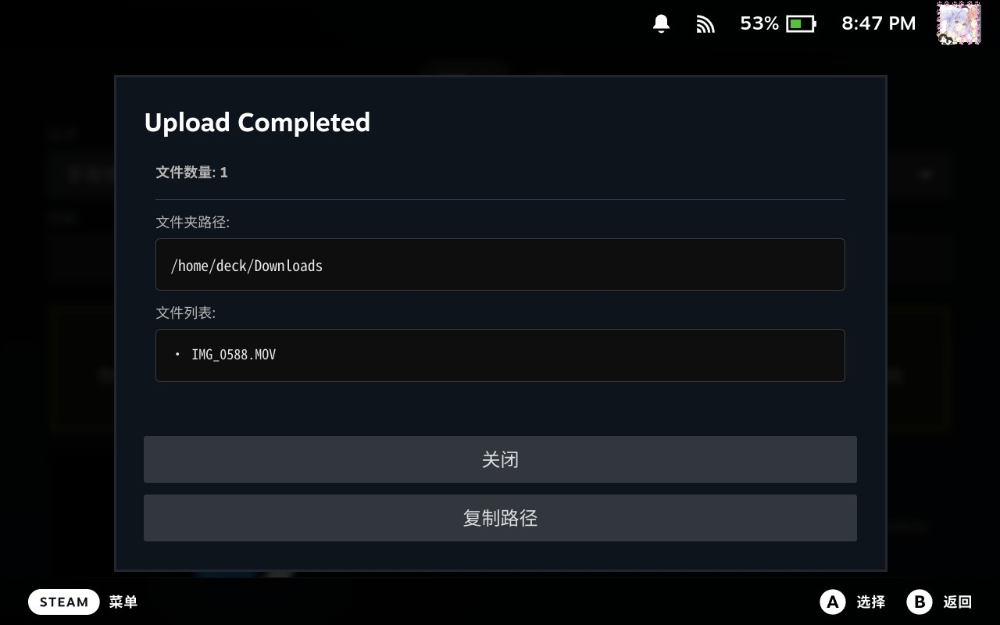
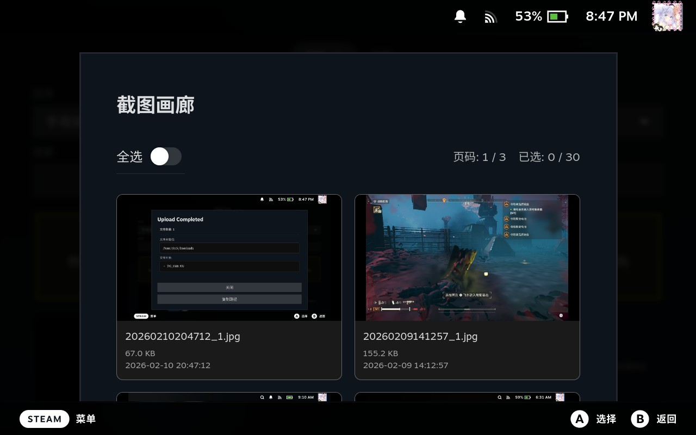
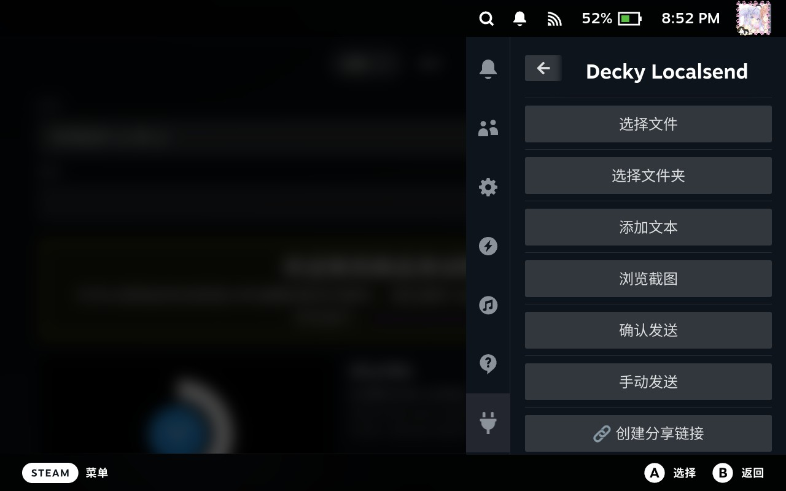
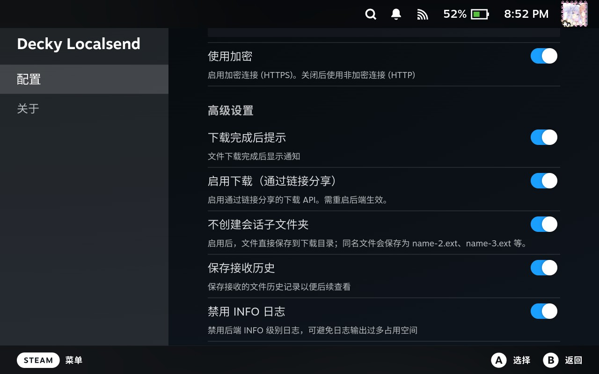

<div align="center">


# LocalSendPlus


<p>


[ENGLISH](README.md) | [简体中文](README-ZH-CN.md)


LocalSendPlus 是原始 [Decky LocalSend](https://github.com/MoYoez/Decky-LocalSend) 项目的扩展版本，将 LocalSend 特性带到 Steam 大屏幕模式中，并提供命名接收位置和基于清单的接收历史浏览器。

原始项目仍然是本插件的 LocalSend 集成、功能和文档基础。

内置后端基于 [MoYoez/localsend-go](https://github.com/MoYoez/localsend-go)。

</div>

---

## 特点

- 全套 Localsend 协议 支持 (除 Web Localsend 外)
- Shared Via Link 链接单向传送文件
- 支持浏览截图上传
- 可保存多个持久化的命名接收位置，指定一个默认位置，并在单次接收时浏览选择其他文件夹
- 浏览新接收记录中的完整文件清单，查看元数据，移动所选项目或整个传输
- 一些 Localsend 自己的特性 (e.g. 接受历史列表 PIN码 ，以及部分环境下 http / https 环境处理)

## 演示






## 使用方法

> 本插件需要在 Decky Loader 3.0 即以上运行

1. 在你的 Steam Deck 上，从已发布的 LocalSendPlus Release 或 Decky 商店条目安装本插件。

> 没有 Decky ? ｜ 请参考 [Decky-Loader](https://github.com/SteamDeckHomebrew/decky-loader) | 如果必要的话，你可以搜索一下 [B站](https://www.bilibili.com/video/BV1X5rGBdEDG) / [抖音](https://www.douyin.com/video/7593785753583340852) 以获取安装方式

1. 从快捷访问菜单中打开插件
2. 点击“启动后端”后，LocalSend 服务器会自动启动
3. 你的 Steam Deck 现在可以被其他 LocalSend 客户端发现
4. 从运行 LocalSend 的任意设备发送文件到你的 Steam Deck


## 配置说明

插件默认使用以下设置：

- **端口 (Port)：** 53317
- **协议 (Protocol)：** HTTPS
- **接收目录 (Receive Directory)：** `~/homebrew/data/localsendplus/uploads`
- **配置文件 (Config File)：** `~/homebrew/settings/localsendplus/localsend.yaml`

你可以在插件界面自定义这些设置。在“接收位置”中可以添加、重命名、更改路径、删除非默认位置，并指定唯一的默认位置。为兼容旧版本，`download_folder` 始终镜像默认位置。自动保存的传输使用开始时捕获的默认位置；手动确认时可以选择任意命名位置，或仅为本次传输浏览一个文件夹。高级设置可以控制是否创建会话子文件夹。

新的接收历史记录会保存完整的精确文件清单。打开新记录即可浏览推导出的文件夹、查看大小和当前路径，选择文件/文件夹并移动到其他命名位置，也可以移动整个传输。移动会保留文件夹结构、避免覆盖（使用 `name-2.ext` / `folder-2` 后缀），跨存储设备复制会先校验再删除源文件；中断操作会在插件启动时恢复。旧记录仍可查看详情，但会标记为旧记录，不能浏览或移动。

## 项目结构

```
.
├── backend/             # Go 后端实现
│   └── localsend/       # LocalSend 协议实现
├── src/                 # 前端 React 组件
│   ├── index.tsx        # 插件主要入口
│   └── utils/           # 工具函数
├── main.py              # Python 后端桥接
├── plugin.json          # 插件元数据
└── package.json         # Node.js 依赖
```

## 待办事项

无🤔

## 已知BUG

- 在部分情况下，LocalSendPlus 无法扫描到开启时间较久的设备 (半分钟扫描一次， 默认超时为 500s，**可使用 主动扫描 来让其他设备检测到此插件** )，如果在可接受范围内没有找到远程设备，请考虑重启需要传输的 Localsend

- 在部分情况下，插件只能在相同的加密协议工作，即使有针对此情况的适配.

- 在大量且多（测试文件数量3000+）传输给 Deck 的时候，因为跑的线程很多，Localsend 传输端 可能会出现抽搐的情况（但实际不影响传输）

- HTTP 扫描可能会造成延迟增加，HTTP超时已经默认调整成 60s ,30s一次，默认使用 Notify 进行设备更新，可不用刷新获取设备

- 请尽量避免单次选择大量文件（建议不超过200个文件）进行传输，过多的文件可能导致 Decky UI 崩溃（文件夹本身数量不受影响，仅单次选择文件数需注意）。

### 兼容表

| 通信方式      | LocalSendPlus 支持 | 能发现的远程 Localsend 设备 | 说明                                      |
|---------------|---------------------|---------------------------|-------------------------------------------|
| UDP 扫描      | HTTP/HTTPS          | HTTP、HTTPS               | UDP 能发现任意协议设备                     |
| HTTP 通信     | HTTP                | HTTP                      | 仅支持与 HTTP 协议设备互通                 |
| HTTPS 通信    | HTTPS               | HTTPS                     | 仅支持与 HTTPS 协议设备互通                |

> UDP 通信下，无论远程设备是 HTTP 还是 HTTPS，LocalSendPlus 都能扫描并发现。


## 关于开发

```bash

# Fork 一份你自己的仓库，替换 {username} 为你的 GitHub 用户名

git clone git@github.com:{username}/LocalSendPlus.git

cd LocalSendPlus/backend/localsend

# 需要 Golang >= 1.25.7

go mod tidy

cd LocalSendPlus/backend/localsend/web

# 需要 NodeJS > 20

npm i

npm build


```

### 编译

参考 [Github Action Build](.github/workflows/build.yaml)

## 鸣谢

- [LocalSend](https://localsend.org)

> 这个插件是基于 Localsend 协议写的，所以快去给个Star吧！

- [Decky Loader](https://github.com/SteamDeckHomebrew/decky-loader)

- [ba.sh](https://app.ba.sh/)
