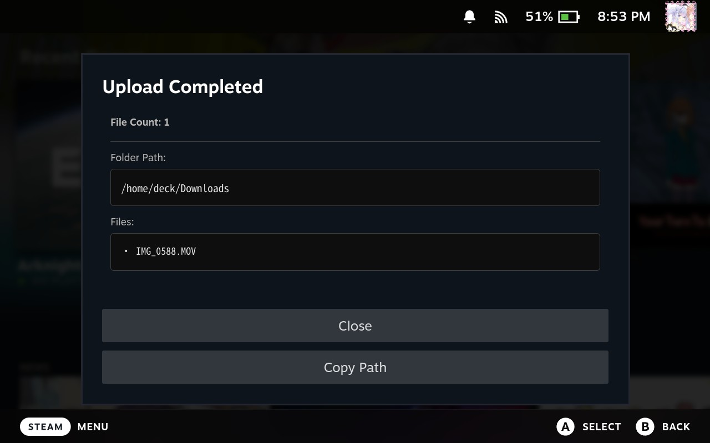
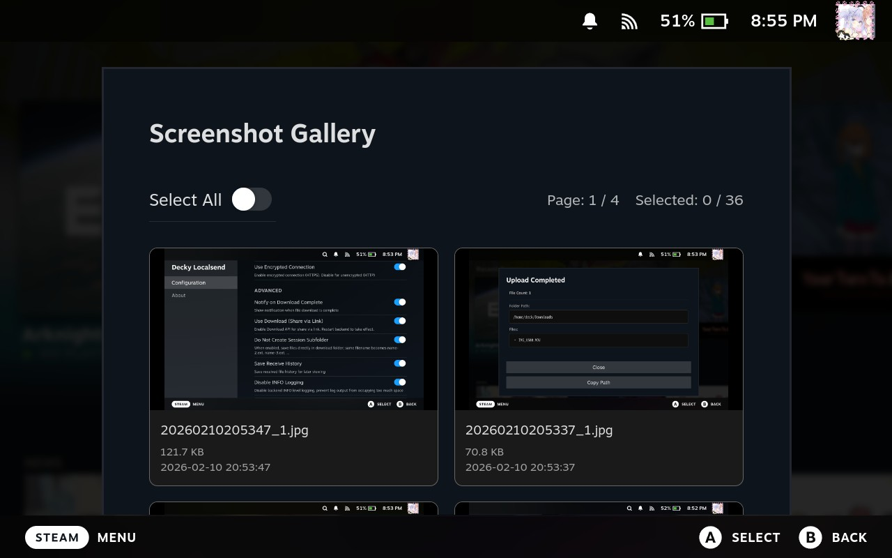
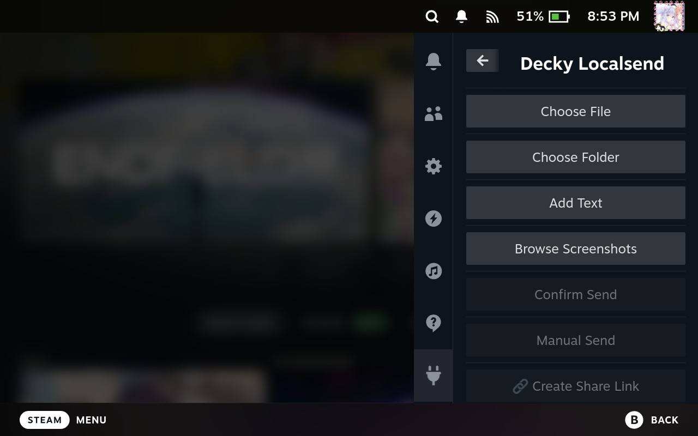
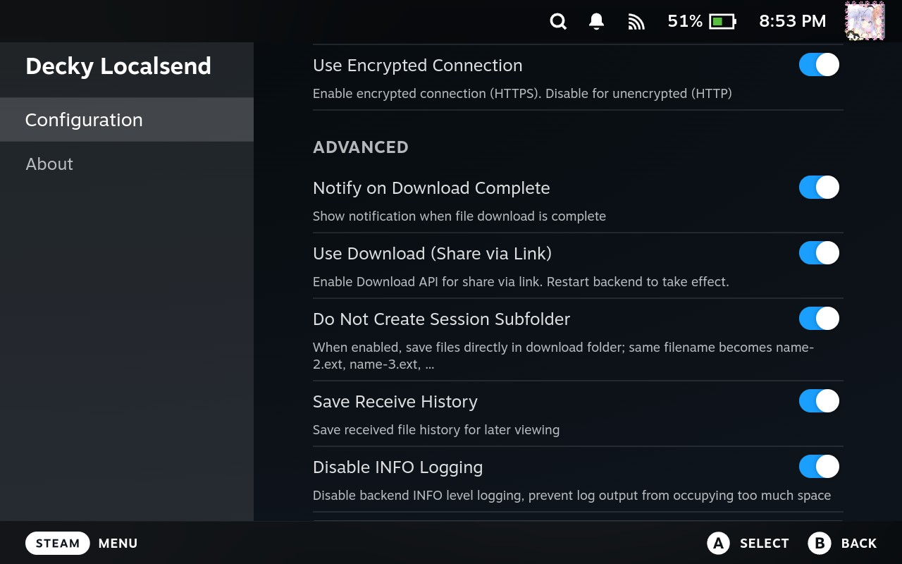

<div align="center">


# LocalSendPlus


<p>
  
  <span style="display:inline-block; width:32px;"></span>
  
</p>

[ENGLISH](README.md) | [简体中文](README-ZH-CN.md)


LocalSendPlus is an extended version of the original [Decky LocalSend](https://github.com/MoYoez/Decky-LocalSend) project. It brings LocalSend functionality to Steam Deck gaming mode with named receive destinations and a manifest-backed receive-history browser.

The original project remains the foundation for the plugin's LocalSend integration, features, and documentation.

The bundled backend is based on [MoYoez/localsend-go](https://github.com/MoYoez/localsend-go).

</div>

---

## Features

- Full LocalSend protocol support (except Web LocalSend)
- "Shared Via Link" for one-way file transfer via link
- Upload and browse screenshots
- Save incoming files to persistent named locations, with one default and one-time per-transfer browsing
- Browse new receive-history manifests, inspect metadata, and safely move selected items or whole transfers
- Some unique LocalSend features (e.g., accepting previous transfer list,  PINs, handling HTTP/HTTPS in certain environments)

## Demo






## Usage

> This plugin requires Decky Loader 3.0 or above.

1. On your Steam Deck, install LocalSendPlus from a published LocalSendPlus release or Decky Store listing.

> Decky not installed?｜ Refer to [Decky-Loader](https://github.com/SteamDeckHomebrew/decky-loader) for help | If necessary, search [Youtube](https://www.youtube.com/watch?v=USnS9K0fpQM) for help.

1. Open the plugin from the Quick Access menu
2. The LocalSend server will start automatically when clicking start Backend
3. Your Steam Deck will now be discoverable by other LocalSend clients
4. Send files from any device running LocalSend to your Steam Deck

## Configuration

The plugin uses the following default settings:

- **Port:** 53317
- **Protocol:** HTTPS
- **Receive Directory:** `~/homebrew/data/localsendplus/uploads`
- **Config File:** `~/homebrew/settings/localsendplus/localsend.yaml`

You can customize these settings through the plugin interface. In **Receive Locations**, create, rename, repath, delete non-default locations, and mark exactly one location as the default. The legacy `download_folder` setting mirrors that default for compatibility. Auto-saved transfers use the default captured when the transfer starts; a manually confirmed transfer can choose any named location or browse to a one-time folder. Session subfolders can be enabled or disabled in Advanced settings.

New receive-history records contain an exact file manifest. Open a new record to browse derived folders, inspect file sizes and current paths, select files or folders, or move the entire transfer to another named location. Moves preserve folder trees where appropriate, never overwrite existing names (they use `name-2.ext` / `folder-2`), verify cross-device copies before deleting sources, and recover interrupted operations on startup. Older records remain viewable as legacy details but cannot be browsed or moved.

## Project Structure

```
.
├── backend/             # Go backend implementation
│   └── localsend/       # LocalSend protocol implementation
├── src/                 # Frontend React components
│   ├── index.tsx        # Main plugin entry
│   └── utils/           # Utility functions
├── main.py              # Python backend bridge
├── plugin.json          # Plugin metadata
└── package.json         # Node.js dependencies
```

## TODO

- None

## Known Issues

- Sometimes plugin cannot detect other machine ( (30s a time automaticlly , default timeout is 500s, can use **Scan Now** To Detect other client ) .If not found, consider restarting remote localsend client.)

- Plugins can only work in same transfer protocol sometimes, although it has detect method to prevent transfer connection failed.

- When transferring a very large number of files (tested with 3000+ files) to the Deck, the sending side of LocalSend may appear to stutter or become choppy due to multiple running threads. However, this does not affect the actual file transfer.

- HTTP scanning may cause increased latency. HTTP timeout has been set to 60 seconds and runs every 30 seconds by default. Devices are updated via Notify, so you do not need to manually refresh to see remote devices.

- please consider not to transfer too much files(selected), which may cause UI crash,folder dont' effect.

### Compatibility Table

| Communication Method | LocalSendPlus Supported | Discoverable Remote Localsend Devices | Notes                                       |
|---------------------|---------------------------|---------------------------------------|---------------------------------------------|
| UDP Scan            | HTTP/HTTPS                | HTTP, HTTPS                           | UDP can discover devices with any protocol. |
| HTTP Communication  | HTTP                      | HTTP                                  | Only devices with HTTP protocol are supported. |
| HTTPS Communication | HTTPS                     | HTTPS                                 | Only devices with HTTPS protocol are supported. |

> With UDP communication, LocalSendPlus can discover remote devices regardless of whether their protocol is HTTP or HTTPS.

## Development

```bash

# Replace {username} with your GitHub username

git clone git@github.com:{username}/LocalSendPlus.git

cd LocalSendPlus/backend/localsend

# require Golang >= 1.25.7

go mod tidy

cd LocalSendPlus/backend/localsend/web

# require NodeJS > 20

npm i

npm build


```

### Build

Please refer to [Github Action Build](.github/workflows/build.yaml)

## Acknowledgments

- [LocalSend](https://localsend.org)

> This Plugin is based on Localsend Protocol, so pls give a star to this!

- [Decky Loader](https://github.com/SteamDeckHomebrew/decky-loader)

- [ba.sh](https://app.ba.sh/)
